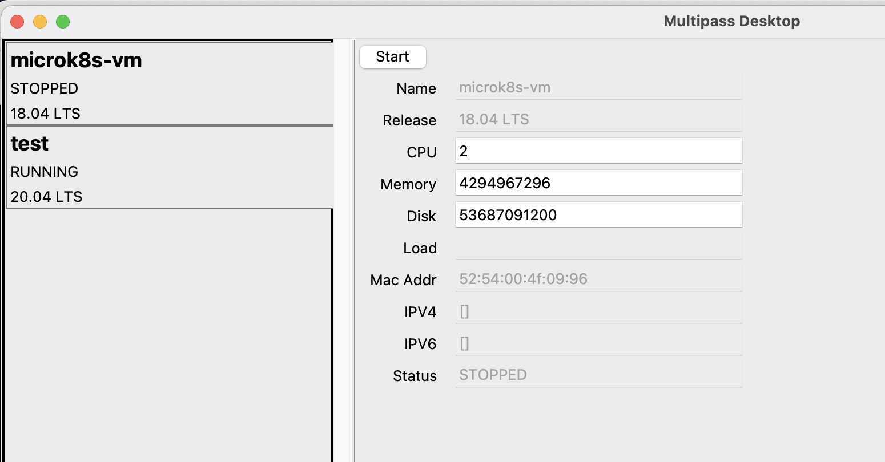

# Multipass Desktop
Desktop interface for Multipass

## config.ini
Current settings are for MacOS.
You might have to check the paths for your OS.

## Run
sudo python ./src/multipass_desktop/app.py

# Disclaimer:
New to both tkinter and gRPC. So might not be the most optimized way.
Current focus is on functionality, not look and feel

# Screenshots:

